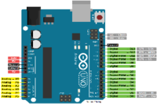
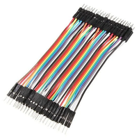
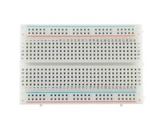
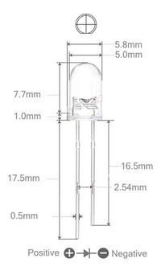
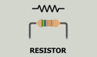
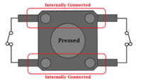
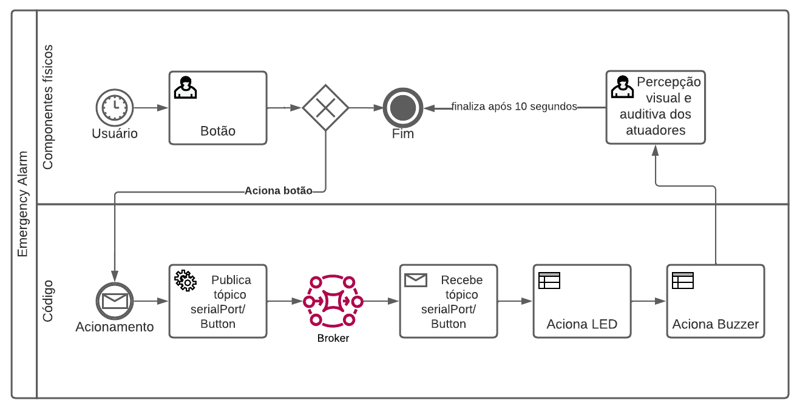

# Emergency-Alarm

Projeto desenvolvido para a aula de Objetos Inteligentes Conectados da Universidade Presbiteriana Mackenzie.

---

## Sumário
1. [Introdução](#Introdução)
2. [Funcionamento](#Funcionamento)
3. [Hardware](#Hardware)
4. [Arquitetura](#arquitetura)
5. [Configurando o ambiente](#environment)
6. [Executando o projeto](#exec)

### <a id="Introdução">1. Introdução</a> 
Pensando em auxiliar a segurança das pessoas utilizando
Internet das Coisas, fora desenvolvido este projeto, que visa a criação de um alarme de emergência, utilizando Arduino UNO e para a comunicação com a Internet o protocolo MQTT.

### <a id="Funcionamento">2. Funcionamento</a> 
O acionamento dos sensores e atuadores se dão da seguinte forma:  
1. O usuário aciona o componente botão;  
2. É feito um tratamento nos dados em que o Arduino envia para o Node-Red, alterando o payload (carga útil) 0 ou 1 para um JSON (Notação de Objeto JavaScript) mais trabalhável;  
3. É feito um Publish para o tópico serialPort/button;  
4. O assinante do tópico serialPort/button recebe o payload;  
5. É verificado se o valor recebido é true (verdadeiro) ou false (falso);  
6. Se for verdadeiro é acionado o LED e o Buzzer;  
7. Caso seja falso é realizado um delay (atraso) de 10 segundos que realizará o desligamento do LED e do Buzzer.

### <a id="Hardware">3. Hardware</a> 
 

**Arduino UNO**

---

 

**Cabo USB**

---

 

**Jumper Macho/Macho**

---

 

**Protoboard 400 Pontos**

---

 

**LED Difuso 5mm Vermelho**

---

 

**Resistor**

---

 

**Buzzer Ativo 5v**

---

 

**Botão Push**

---
### <a id="arquitetura">4. Arquitetura</a> 

 
 

---
### <a id="environment">5. Configurando o ambiente</a> 
Para executar o projeto é necessário a instalação e configuração das ferramentas descritas abaixo. Os links possuem além do download um guia de como instalar corretamente.
#### 5.1. Instalando Arduino IDE
A instalação do Arduino IDE pode ser feita através do site [oficial](https://docs.arduino.cc/software/ide-v2/tutorials/getting-started/ide-v2-downloading-and-installing).

#### 5.2. Instalando Firmata
A instalação do Firmata pode ser feita através do site [Instructables](https://www.instructables.com/Arduino-Installing-Standard-Firmata/), como opção em vídeo temos o seguinte canal [DesignerTech](https://www.youtube.com/watch?v=2L8YYJpfuvE&ab_channel=DesignerTech).

#### 5.3. Instalando Node-Red
A instalação do Node-Red pode ser feita através do site [oficial](https://nodered.org/docs/getting-started/local). 

---
### <a id="exec">6. Executando o projeto</a> 
- Após concluir a configuração, realize o upload do Firmata em seu Arduino para mais [informações](https://www.instructables.com/Arduino-Installing-Standard-Firmata/);
- Execute o comando `node-red` em seu terminal;
- Em seu navegador acesse o link gerado pelo node-red: `http://127.0.0.1:1880/`;
- Importe o arquivo `flow-emergency-alarm`;
- Altera a porta dos inputs e outputs do Arduino, sendo estes o **Botão**, **LED** e **Buzz**. Para tal clique sobre os inputs/outputs e na propriedade (ports) mude para o USB em que seu arduino se encontra conectado;
- Clique no botão `deploy` e aguarde a mensagem de sucesso.

Com os passos concluídos será possível utilizar o projeto.